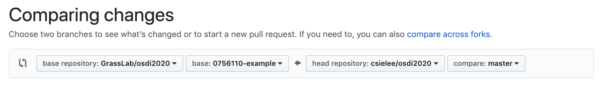

# Operation System Design and Implementation Course 2020

[中文](讀我.md)

## Author

| 學號 | GitHub 帳號 | 姓名 | Email |
| --- | ----------- | --- | --- |
|`0756049`| `ierosodin` | `許耕福` | ierosodin@gmail.com |

This repository is homework submission for students

## How to submit homework

1. Fork [this repository](https://github.com/GrassLab/osdi2020) on GitHub 
    
2. Write down following info in your `README.md`
    - GitHub account name
    - Student ID
    - Your name
3. Design and implement your kernel in forked repository
4. Create a GitHub pull request
    - Choose `GrassLab/osdi2020` as base repository and `{your student ID}` as base branch
    - Choose branch in your forked repository as compare branch
    
    - Name it with student ID and which lab e.g. `0756110 lab0`
    
5. We will accept pull request when lab due date

repeat 3-5 to submit later homework/lab.

## Example

- forked repository: https://github.com/csielee/osdi2020
- pull request: https://github.com/GrassLab/osdi2020/pull/2

## Happy Coding ~
