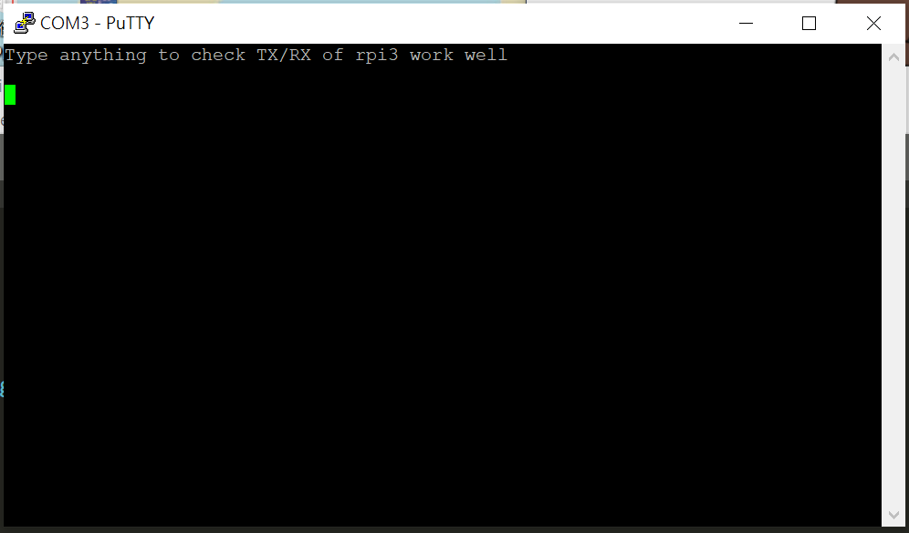

Lab0
===
## Github
```
git clone --branch <tag> <repo>
```

## Build
### 安裝 QEMU 
> 因為使用 apt 工具安裝的 QEMU 並不支援 Pi 3，所以必須自己手動編譯。

- 安裝工具
```
sudo apt install gcc build-essential automake gcc-arm-linux-gnueabihf
```
- 下載 source code
```
wget https://download.qemu.org/qemu-4.2.0.tar.xz
```
- 解壓縮
```
tar xvf qemu-4.2.0.tar.xz
```
- 配置設定
```
cd qemu-4.2.0
```
```
./configure --target-list=arm-softmmu,aarch64-softmmu
```
- 編譯及安裝
```
make -j$(nproc)
make install
```
- 設定路徑
```
echo "export PATH=$(pwd)/aarch64-softmmu:\$PATH" >> ~/.bashrc
source ~/.bashrc
```

### 編譯過程中遇到的 Error
- Error 1
```
ERROR: pkg-config binary 'pkg-config' not found
```

```
$ sudo apt-get install pkg-config
```
- Error 2
```
ERROR: glib-2.48 gthread-2.0 is required to compile QEMU
```
```
$ apt-get install libglib2.0-dev zlib1g-dev
```
- Error 3
```
ERROR: pixman >= 0.21.8 not present.
       Please install the pixman devel package.
```
```
$ apt-cache search pixman
$ sudo apt-get install libpixman-1-dev
```

## Run
```
make
```
```
make clean
```

## How to burn it into pi3
Use [Win32 Disk Imager](https://sourceforge.net/projects/win32diskimager/) to burn the kernel8.img onto SD card.

#### List of hardware:
1. Laptop (or PC)
2. USB to TTL serial converter
3. Female to Female jumper wire
4. Raspberry Pi

#### Connections
| Converter | Raspberry PI | 
| :--------: | :--------: |
| GND     | GND    |
| RX     | TX    |
| TX     |  RX   |

#### Result
