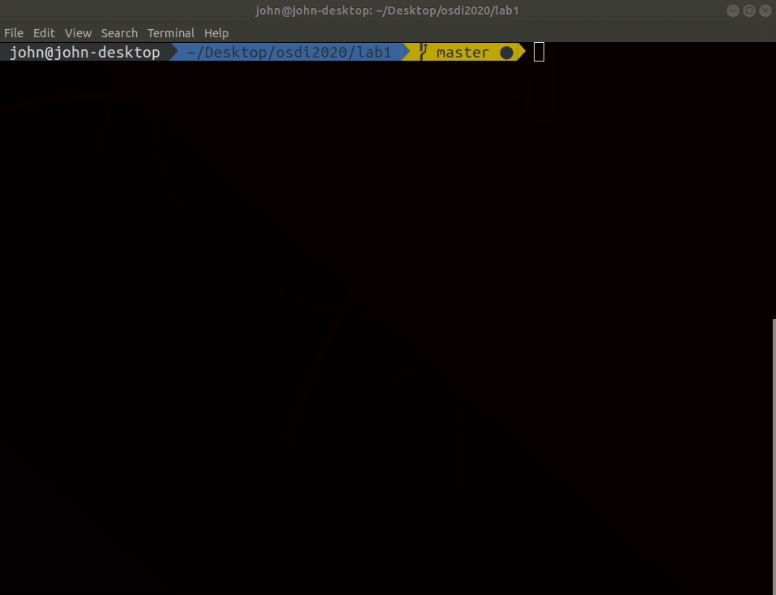
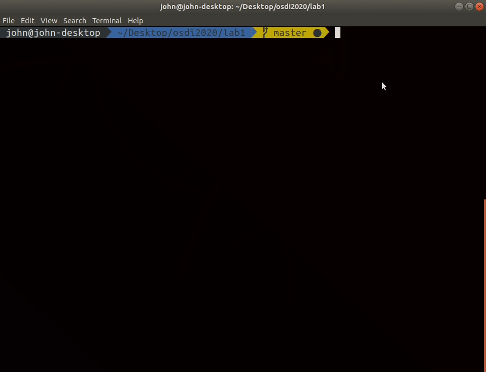

# Lab1: Hello World
## Introduction
In Lab 0, you already set up the working environment for bare metal programming.

In this lab, you’ll get your hand dirty by implementing a basic shell. You need to set up mini UART and let the host computer and rpi3 communicate through it.

## Goals of this lab
- Practicing bare-metal programming.
- Understand how to access rpi3’s peripheral.
- Set up mini UART.

## TODO list

### Basic initialization
- [x] [required]Implement the 3 basic steps.
  - Let only one core proceed, and let others enter a busy loop.
  - Initialize the BSS segment.
  - Set the stack pointer to an appropriate position.
- [x] [question]Is it reasonable to accelerate booting speed by parallel programming during the initialization stage?
  -  I thought the answer is no. During the booting stage, there is no scheduler, hance every core will execute the same code, which does not accelerate booting speed.

### Mini UART
- [x] [required]Following UART to set up mini UART.

### Simple Shell
- [x] [required]Implement a simple shell, it should support the following commands.
  - `hello`
  - `help`
- [x] [elective]Write a program or script on your host computer which can read a text file and write the content to rpi3.
 
### Get time
- [x] [elective]Add <timestamp> command, it print current timestamp.

### Reboot
- [x] [elective]Add <reboot> command.
  - Note: I am a auditor, so I do not have the raspi3 to test this feature. 

### Result
- [x] [question]Point out the difference between bare-metal programming and programming on top of operating system.
  - Bare-metal programming does not exist OS, which means everything needs to be written by yourself. 
For example, you can not use the `printf` function, you need to implement the function by ourself. In addition, this stage does not have the memory manager, so we need to init the memory section(for example, the bss section, which stores the uninitialized global variable) first and put the variable into the assigned address, to make sure we get the initialized the variable.

## Autotesting
For autotesting, we need pexpect module and python2. type the follow command to install pexpect

```text
pip install pexpect
```
and you can use `make autotest` to start autotesting

## Demo
### Mini-bash


### Autotesting

