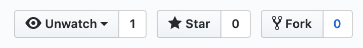

# 作業系統設計與實作 課程 2020

[英文](README.md)

給學生繳交作業的儲存庫

## 如何繳交作業

1. 在 GitHub 複製 ( fork ) [該儲存庫](https://github.com/GrassLab/osdi2020)
    
2. 撰寫以下資訊在你的 `README.md`
    - GitHub 帳號名稱
    - 學號
    - 你的姓名
3. 設計並實作你的 kernel 在複製出的儲存庫
4. 建立一個 GitHub 拉取請求 ( pull request )
    - 選擇 `GrassLab/osdi2020` 當作 基儲存庫 ( base repository ) 和 `{你的學號}` 當作 基分支 ( base branch )
    - 選擇在你的儲存庫內的分支作為 比較分支 ( compare branch )
    
    - 用學號與哪一次 lab 命名它 範例: `0756110 lab0`
    
5. 我們將會在 lab 截止時接受拉取請求

重複 3-5 步去繳交之後的 lab.

## 範例

- 複製的儲存庫: https://github.com/csielee/osdi2020
- 拉取請求: https://github.com/GrassLab/osdi2020/pull/2

## Happy Coding ~